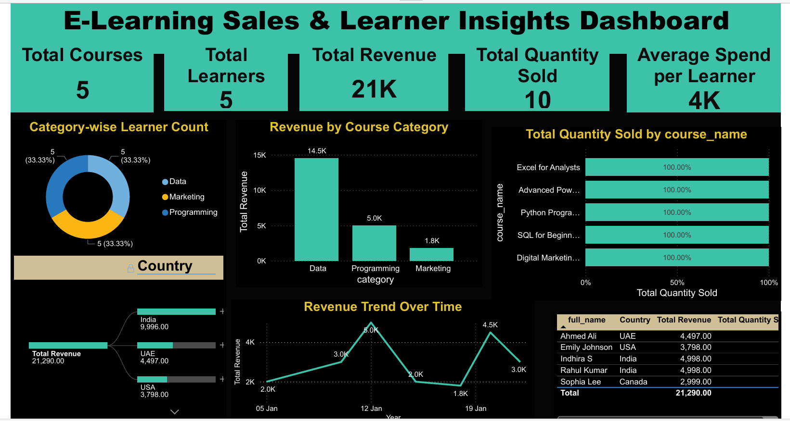

# 📊 E-Learning Sales & Learner Insights Dashboard  
### 🧠 SQL Analytics | 📈 Power BI Visualization

---

## 🔍 Project Overview
This project focuses on analyzing **e-learning platform sales data** to uncover meaningful insights into  
**learner behavior, course performance, and revenue trends**.

The backend analysis is performed using **MySQL**, while **Power BI** is used to create an interactive and insight-driven dashboard for business decision-making.

---

## 🗂️ Database Structure
- **learners** – learner profile and country details  
- **courses** – course name, category, and unit price  
- **purchases** – transaction records (quantity, date, course, learner)

---

## 🛠️ Tools & Technologies
- 🐬 **MySQL** – DDL, DML, JOINs, Aggregations  
- 📊 **Power BI** – KPI Cards, Charts, Decomposition Tree, Smart Narrative  
- 🧮 **SQL** – INNER / LEFT / RIGHT JOIN, GROUP BY, HAVING, WHERE  

---

## 📈 Analysis Performed
✔ Learner-wise total spending analysis  
✔ Top 3 most purchased courses  
✔ Category-wise revenue & unique learner count  
✔ Identification of multi-category learners  
✔ Validation of courses with no purchases  

---

## 📊 Dashboard Preview
> **Power BI – E-Learning Sales & Learner Insights**

---

## 🔑 Key Insights
- 🥇 **Data category** generates the highest revenue  
- 🌍 **India** is the top contributing country  
- 🔁 Some learners purchase courses from **multiple categories**  
- ✅ All available courses have recorded purchases  

---

## 💡 Business Recommendations
- 🎯 Focus marketing efforts on **high-performing categories**
- 📢 Promote **top-selling courses** across regions
- 📦 Introduce **cross-category bundle offers** to increase revenue  

---

## 📁 Repository Contents
- 📄 `elearning_project.sql` – Database schema & analytical queries  
- 📊 Power BI dashboard screenshots  
- 📝 One-page summary report (PDF)  

---

## 👩‍💻 Author
**Indhira S**  
Aspiring Data Analyst | SQL | Power BI | Data Visualization  

🔗 *Add GitHub / LinkedIn links here*
